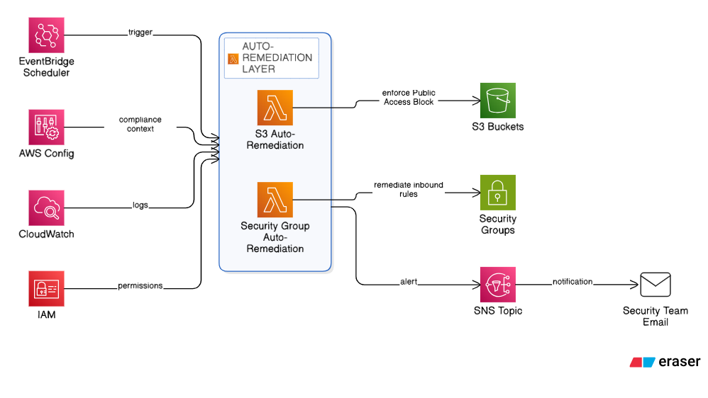
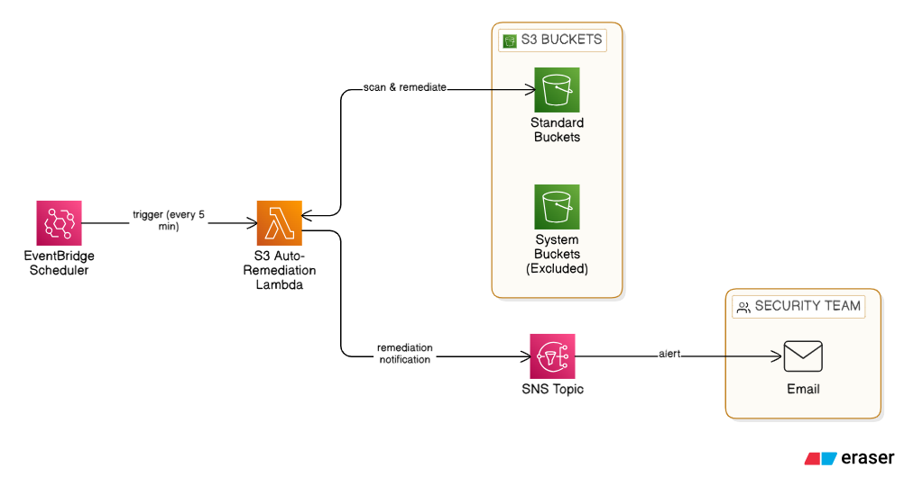
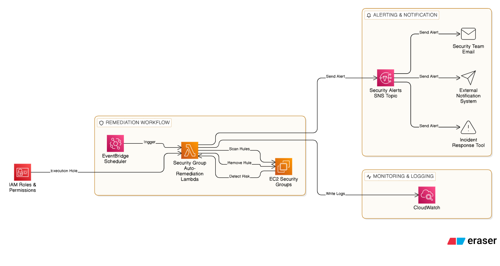

<!DOCTYPE html>
<html>
<head>
    <meta charset="UTF-8">
    <meta name="viewport" content="width=device-width, initial-scale=1.0">
</head>
<body>

<h1>📁 Final Cloud-Security Structure (Phase 2)</h1>

<h2>Project Structure</h2>
<pre>
cloud-security/
├── lambda/
│   ├── s3_auto_remediation.py
│   ├── sg_auto_remediation.py
├── config_rules/
│   ├── s3-public-access-rule/
│   └── sg-open-ports-rule/
├── diagrams/
│   ├── s3_auto_remediation_architecture.png
│   ├── sg_auto_remediation_architecture.png
│   └── overall_phase2_architecture.png
└── screenshots/
</pre>

<h2>🧩 System Architecture (High Level)</h2>

<h2>📂 1️⃣ lambda/ (Lambda Functions)</h2>

<strong>This folder contains ALL Lambda source code.</strong>

<h3>🔹 s3_auto_remediation.py</h3>
<h2>🧩 S3 Auto Renediation Architecture (Base Level)</h2>

S3 bucket auto-remediation Lambda function with the following features:

<ul>
    <li>Detects public S3 buckets</li>
    <li>Enforces Public Access Block</li>
    <li>Sends SNS alerts on remediation</li>
    <li>Supports bucket exclusions</li>
</ul>

<h3>🔹 sg_auto_remediation.py</h3>
<h2>🧩 Sg Auto Remediation Architecture (Base Level)</h2>

Security Group auto-remediation Lambda function:

<ul>
    <li>Detects 0.0.0.0/0 inbound rules</li>
    <li>Identifies risky SSH/RDP/ALL traffic rules</li>
    <li>Automatically removes insecure rules</li>
    <li>Sends SNS alerts</li>
</ul>

<h2>Lambda Functions</h2>

<pre>s3_auto_remediation.py</pre>

Automatically detects and remediates public S3 buckets using 
Public Access Block enforcement.

<pre>sg_auto_remediation.py</pre>

Automatically detects and removes insecure Security Group rules 
such as SSH/RDP open to the internet.

<h2>📂 2️⃣ config_rules/ (AWS Config Rules)</h2>

Contains AWS Config rule configurations for compliance detection.

<h3>Structure:</h3>
<pre>
config_rules/
├── s3-public-access-rule/
└── sg-open-ports-rule/
</pre>

<strong>Purpose:</strong>

<pre>
This folder contains AWS Config rules used to detect 
non-compliant cloud resources.

These rules can be integrated with Lambda for auto-remediation.
</pre>

<h2> 3️⃣ (Testing)</h2>

Helper scripts for testing validation.

<h3>Test S3 Violation</h3>
<pre>
1. Create an S3 bucket
2. Disable Block Public Access
3. Wait 5 minutes
4. Lambda remediates automatically
5. SNS email received
</pre>

<h3>Test Security Group Violation</h3>
<pre>
1. Add SSH (22) from 0.0.0.0/0
2. Wait 5 minutes
3. Lambda removes rule
4. SNS email received
</pre>

<h2>📂 4️⃣ diagrams/ (Architecture Diagrams)</h2>

Visual representation of the remediation workflows.

<h3>Contents:</h3>
<pre>
diagrams/
├── s3_auto_remediation_architecture.png
├── sg_auto_remediation_architecture.png
└── overall_phase2_architecture.png
</pre>

<strong>What these diagrams show:</strong>

<ul>
    <li>EventBridge → Lambda → AWS resource flow</li>
    <li>SNS → Email notification path</li>
    <li>Scheduled remediation architecture</li>
</ul>

<h2>📂 5️⃣ screenshots/ (Evidence)</h2>

Store screenshots of:

<ul>
    <li>Lambda execution logs</li>
    <li>SNS email notifications</li>
    <li>Before/after remediation states</li>
    <li>CloudWatch metrics</li>
</ul>

><strong>Demo Video Link:</strong>
<a href="https://drive.google.com/drive/folders/12vFNEkZRQHHyv405QpJz1vvhcPOl7BRh?usp=sharing" target="_blank">Screenshots</a>

<h2>Technologies Used</h2>
<ul>
    <li>AWS Lambda</li>
    <li>EventBridge Scheduler</li>
    <li>Amazon SNS</li>
    <li>Amazon S3</li>
    <li>Amazon EC2 Security Groups</li>
</ul>

</body>
</html>
